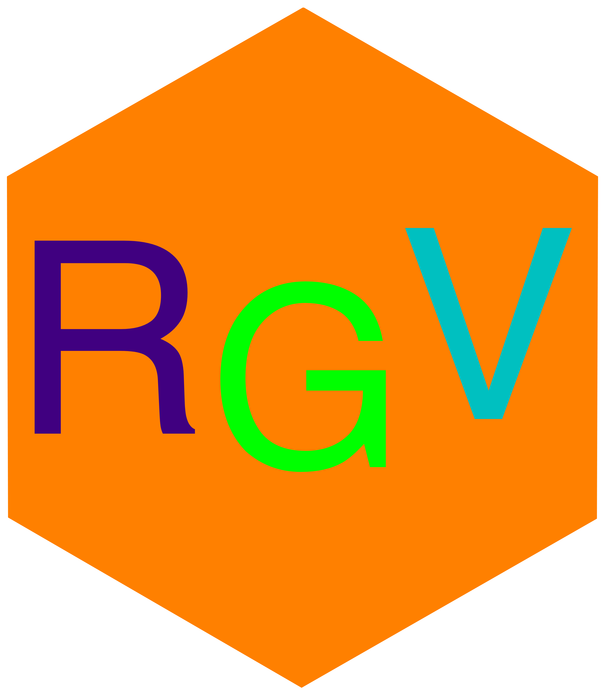

<h1 align="center">
  
   
  Rust Graph Visualiser
</h1>

## Contents
- [Description](#description)
- [Screenshots](#screenshots)
- [Installation](#installation)
  - [Precompiled binaries](#precompiled-binaries)
  - [Compile from source](#compile-from-source)
- [Possible future additions (no guarantee)](#possible-future-additions-no-guarantee)
- [Acknowledgements](#acknowledgements)

## Description
A visualisation program that showcases what a graph is (in the context of <abbr title="computer science">CS</abbr>).
It allows the user to create a graph that has at most 100 nodes and to connect those nodes freely with
weighted edges. Bidirectional edges are also supported. One can also specify a start and end node and
if possible the program tires to find the shortest path between the two.

All the instructions and configurations can be done inside the program, although the configuration isn't
persistent.

This program is also available as a [web app](https://an-iceberg.github.io/rust_graph_visualiser).

## Screenshots

## Installation

### Precompiled binaries

Precompiled binaries are available for Linux and Windows. Download the
[latest version](https://github.com/an-Iceberg/rust_graph_visualiser/releases/latest)
from the [releases page](https://github.com/an-Iceberg/rust_graph_visualiser/releases).

### Compile from source

1. Make sure the latest version of [Rust](https://www.rust-lang.org/) is installed on your system.
2. Clone this repository onto your machine: `git clone https://github.com/an-Iceberg/rust_graph_visualiser && cd ./rust_graph_visualiser`
3. Compile the program with: `cargo build --release`
4. After it is done compiling the binary can be found at `rust_graph_visualiser/target/release/`.

## Possible future additions (no guarantee)
- Minimum spanning tree

## Acknowledgements
- Creator of the cmatrix `README` for the awesome idea of the rainbow bar.
- [Javidx9](https://github.com/OneLoneCoder) (aka. OneLoneCoder) for being an awesome teacher
